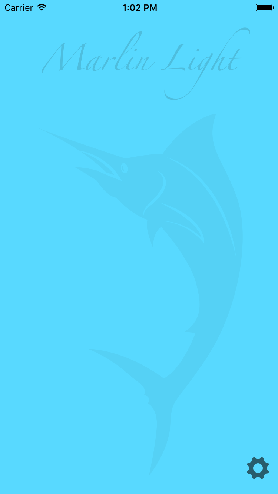
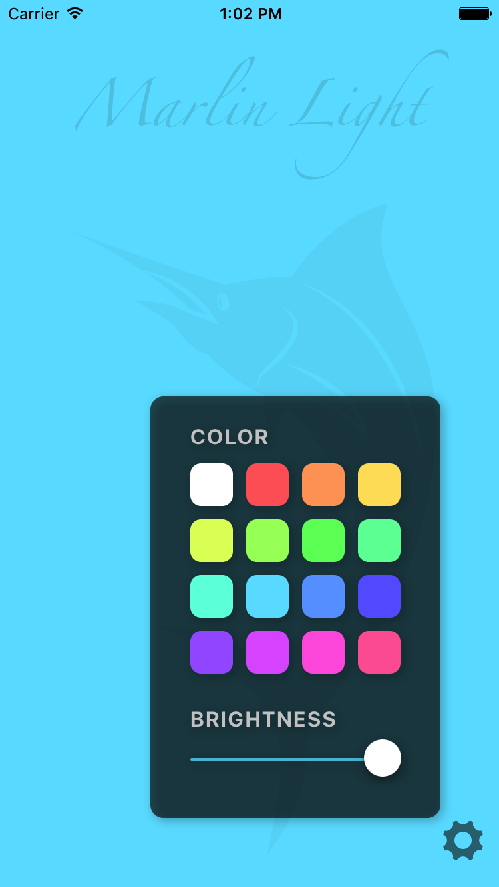

## Marlin Light
Marlin Light is a trivial "flashlight" app for iOS written in Swift. It simply allows the user to set the background color and brightness level of the screen. It also disables the idle timer so the screen won't darken until after the iOS lock screen is activated.

My friend Marlin asked for this app because he reads physical books in a dark room by using his iOS device to light the book.

Really though this was just a way to practice modern Swift, Auto Layout, and Sketch.

## Screenshots
 

## Acknowledgements

- The settings (cog) image is from [Entypo](http://www.entypo.com) by Daniel Bruce and available under the license [CC BY-SA 4.0](https://creativecommons.org/licenses/by-sa/4.0).
- The [marlin image](https://thenounproject.com/term/marlin/11436/) is by Gilad Fried and available under the license [CC BY 3.0 US](https://creativecommons.org/licenses/by/3.0/us).